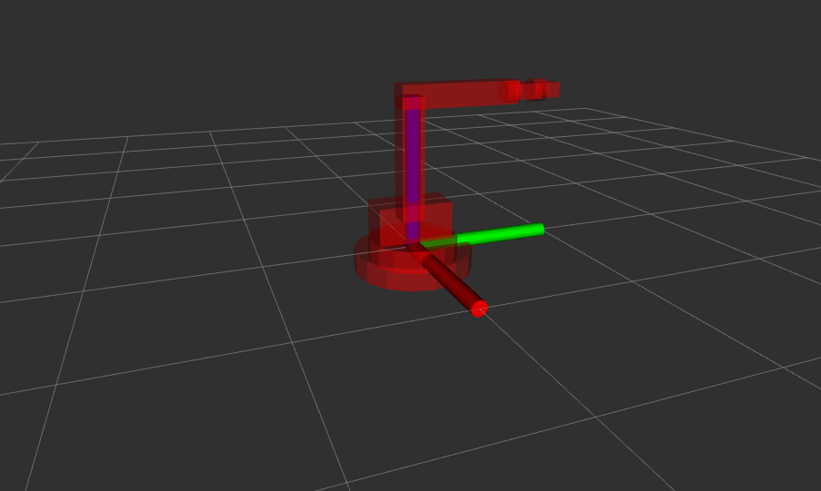

    

   

## Quick Start to launch in gazebo 
1)  First open the Terminal and apply this command
        git clone https://github.com/razainno/kuka_robot_urdf.git
        cd kuka_robot_urdf/
        catkin_make
        source devel/setup.bash 

        roslaunch kuka_robot gazebo1.launch 

## launch of the controller to see the movement of the Robot
   open the terminal and apply these command 
        cd kuka_robot_urdf/
        catkin_make
        source devel/setup.bash
        cd src/kuka_control/scripts/
        rosrun kuka_control mains.py

## Robot display with Rviz 

## unit Test for kuka robot

This unit test is to  check the correctness of forward kinamatics  for kuka robot.

To run unit test:
open new terminal 

cd kuka_robot_urdf/
        catkin_make
        source devel/setup.bash
        rosrun kuka_test FK_TEST.py

## integiration test
cd kuka_robot_urdf/
        catkin_make
        source devel/setup.bash
        rosrun kuka_test integ.py
        roslaunch kuka_robot gazebo1.launch
open new terminal and run the publisher using this command
        rosrun kuka_robot joint_space_subscriber.py

